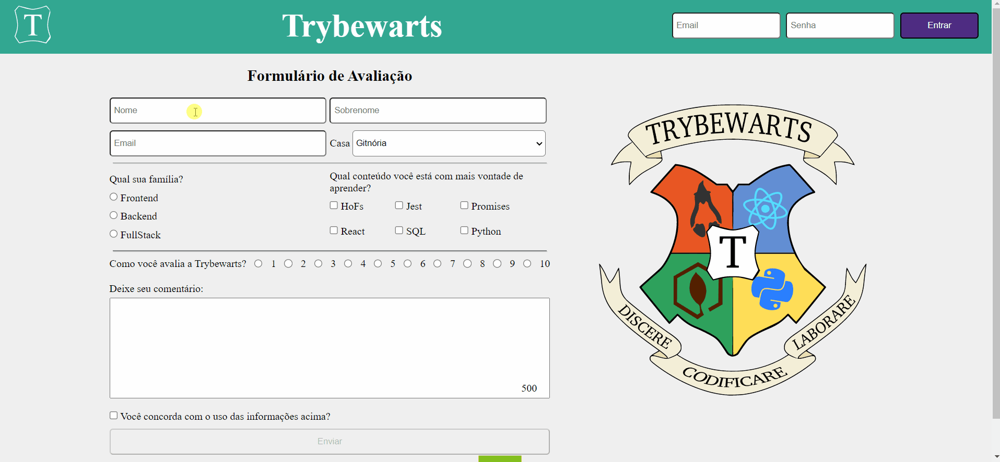

# Trybewarts :dizzy:
Projeto realizado durante o curso de desenvolvimento web na Trybe (Bloco 6)

## :fire: Tecnologias: 
* HTML
* CSS
* Javascript

## :point_down: Link para acesso a página do projeto:
https://fa-biano.github.io/Trybewarts/

## :rocket: Demonstração:

